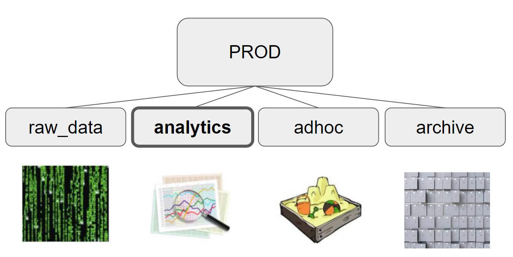

# 👀 데이터 엔지니어가 하는 일

데이터 엔지니어는 기본적으로 '소프트웨어 엔지니어'다. 
회사에 필요한 내부, 외부 데이터들을 저장할 수 있는 '**데이터웨어하우스**' 를 만드는 것 
데이터 웨어하우스가 정해지면 그 데이터웨어하우스에 내부,외부 데이터를 적재해야한다 (= **ETL**) 
`ETL` 이란 **추출(Extract), 변환(Transform), 적재(Load)** 의 약자이다. 
데이터 적재하는 ETL 과정을 '**데이터 파이프라인**'을 만드는 작업 이라고도 한다. 
어떤 소스에 있는 데이터를 읽어다가 내가 원하는 포맷으로 변환을 해서 데이터웨어하우스에 로드하는 것이다. 
결국 데이터엔지니어가 하는 일은 **중앙 데이터베이스 만들고**, **여러 데이터 소스로부터 데이터를 읽어**다가 내가 **원하는 형태로 변환**한 다음에 **테이블 형태로 데이터웨어하우스에 저장**하는 **코드를 만드는 일**을 한다. 
'**데이터 인프라**'를 만든다고 할 수 있다. 

 

# ✏ 데이터팀에서 일하면서 배우신 것

### 1) 신뢰할 수 있는 데이터 가지고 부가가치를 만들어내는 것

: 회사 관점에서는 부가가치(매출에 이득)가 없으면 아무 의미가 없다.

### 2) 데이터 인프라는 있어야 한다.

인프라를 만들 때 고민해봐야할 것들

- **Cloud** vs **On-promise** : Cloud로 가는게 맞다! 분명하게 말할 수 있다.
- **Batch** vs **Real Time** : ?

### 3)데이터 퀄리티가 제일 중요하다. (=쓰레기가 들어가면 쓰레기가 나온다.)

### 4)어떻게 내일의 성과를 측정할거냐.

뭐를 하건 내일의 성과를 측정할 방법을 생각해봐라.(TODO 리스트 or 숫자로 나오는 것을 보고 판단) = A/B 테스트 (?) = 객관적으로 비교할 수 있는 방법을 만들고, 그것을 사람들이 신뢰할 수 있는 방법이 있다면 결정하는 건 쉽다.

A/B테스트 툴 : Optmizely (돈 없으면 Google Optimize...)

### 5) 간단한 솔루션이 좋은 솔루션이다.

머신러닝 배운 사람들은 어떤 문제든 머신러닝을 사용해서 개발하려고 한다. if문 3개로 될 것을...
= 필요없는 리소스를 쓰는 것이다.

 

# ⚙ Skillset

- **SQL** : Hive, Presto, SparkSQL, ... (조금 더 어려운 SQL)
- **Programming Language** : Python/Scala/Java 
(데이터 과학자와 일한다고하면 Scala/Java 가 필요한 경우가 있다.)
- **Large Scale Computing Platform** : Spark/YRAN 
(데이터 분석가와 일한다고 하면 필요하지는 않다. SQL로 충분하다.)
- **Knowledge** : 머신러닝, A/B 테스트, 통계
- **Cloud Computing (DW)** 
a. Redshift/EMR/S3/SageMaker from AWS 
b. BigQuery/ML Engine from GCP 
c. Snowflake
- **ETL Scheduler** : Airflow, ...  
(데이터 파이프 라인을 어떻게 만들고, 어떻게 관리하는지가 중요해진다.) 
(가장 많이 쓰는게 Airflow(Airbnb에서 만듦)라는 Open Source이다.)

# 🛢 Data Warehouse

**회사에서 필요한 내부,외부 데이터를 저장하는 곳**

회사의 데이터 크기에 따라서 어떠한 관계형 DB든지 상관없다.
근데 데이터 어느정도 커지면 MySQL, Postgres 등 서버 한 대짜리 관계형 DB로는 동작을 할 수 없다.
그 순간부터는 Cloud에서 제공해주는 DW나 하둡기반, 스파크기반의 DW 쓰기 시작해야 한다.

### 1) Data Lake 와 차이점

DW보다 조금 더 데이터가 크다는 느낌이 있다.
DW라고 하면 기본적으로 데이터들이 table 형태(Struct 된 형태)로 저장이 된다는 게 기본인데,
DL라고 하면 Struct 되지 않은 데이터들도 있다고 할 수 있다.

### 2) Scalability

- Storage (데이터의 양)
- Computation (데이터로하는 계산)

### 3) 옵션

- 데이터 크기가 크지 않으면 MySQL/Postgres 를 사용하면 된다.
- Cloud Data Warehouse 의 2가지 종류
- Fixed capacity : Redshift (고정액 지불 후, 데이터 베이스의 용량이 정해진 방식)
- Dynamic capacity : Snowflake, BigQuery (사용한 만큼 요금을 지불하는 방식)
- Hive/Spark
- S3

### [ Fixed capacity vs Dynamic capacity ]

**Fixed capacity**

고정액을 지불하고 어느정도 공간을 사는 것이다.  
(한달에 지정된 돈을 내는 한, 얼마나 사용하느냐 상관이 없다.) 
- 장점 : 돈 얼마내는지 분명하다.
- 단점 : 쓰려고 하는 데이터가 늘어나면 다 에러가 난다, 사용하지 않아도 돈은 나간다. (=탄력적으로 운영할 수 없다.)

**Dynamic capacity**

미리 돈을 내고 고정된 용량을 사는 것이 아니라. 
쿼리를 날릴 때마다 디스크 얼마나 쓰였고, CPU가 어느정도 쓰였는지 사용된 만큼 과금되는 방식이다. 

장점 : 안 쓰면 돈 안내고, 쓰면 쓴 만큼 돈 낸다. 
단점 : 엄청나게 큰 JOIN 쿼리를 동작시킨다면 끝까지 실행된다. 그리고 엄청나게 큰 금액을 지불할 수도 있다.

 

# 🛢 Date Warehouse Structure

DW하우스 밑에 폴더(PROD)를 만든다.
Table들을 만들 때 플랫하게 만드는게 아니라 폴더로 만드는 것이다.
이 때 폴더는 **4개의 폴더**를 가지도록 만든다

- `raw_data` : 외부, 내부에서 카피되어 온 테이블(데이터)
- `analytics` : raw_data에 있는 수많은 테이블들을 주기적으로 요약한 테이블
- `adhoc` : 테스트용으로 테이블 만들 일 있을 때
- `archive` : 더이상 필요없는 테이블들이 생기면 바로 삭제하지 않고 우선 옮겨놓는 폴더

 

# 🤝 Supporting Data Analysts and Data Scientists

### 1. 데이터 웨어하우스에 충분한 용량이 있는것을 보장하는 것.

데이터 분석가나 데이터 과학자 관점에서는 쿼리를 날려서 분석하고 싶은데, 
DW가 바빠서 쿼리를 날리면 오래걸리고 Fail이 된다면 당연히 반응이 좋지 않다.

### 2. DA를 위해 Copy한 데이터(raw_data)를 통해 요약 테이블을 생성하는 것

 

# ✨ 트랜드

- **Cloud Data Warehouse를 사용**
- **실시간으로 데이터를 처리하는 방식을 사용**
- **ETL 해주는 SaaS(서비스)가 나오고 있음**