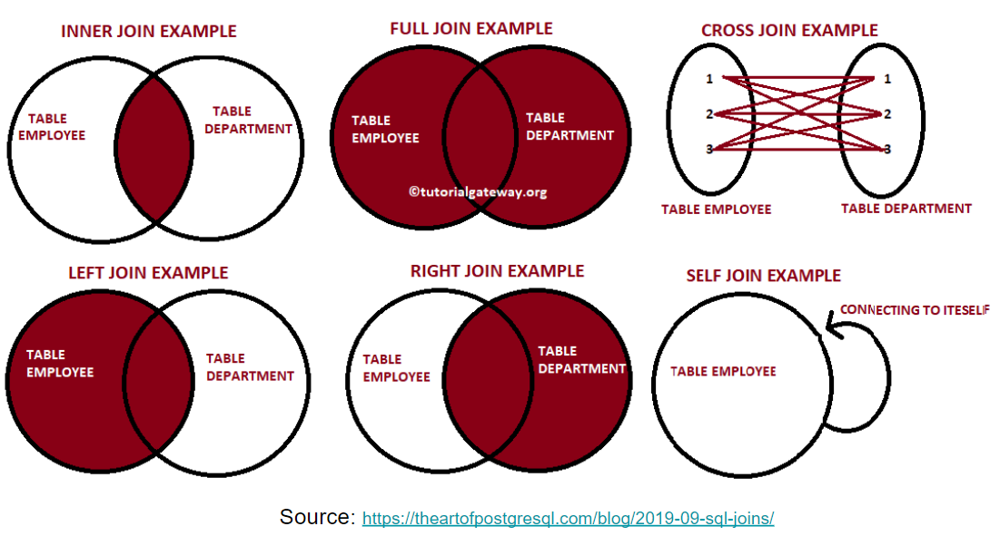

# 📌 DDL (Data Definition Language)

### 1) CREATE TABLE

- 테이블을 만드는 것
- Primary Key를 항상 지정.</br>
**하지만 Big Data WareHouse(Redshift, Snowflake, BigQuery) 에서는 지켜지지 않는다.**</br>
(why? pk를 지정하면 레코드가 삽입될때마다 pk가 이미 존재하는건지 아닌지 확인해야하기 때문에 속도가 확 느려진다.)
- 그래도 PK는 설정해주는 것이 좋다. 힌트 역할을 한다.
- **CTAS (`CREATE TABLE table_name AS SELECT`)</br>
:** 테이블을 만드는 데 테이블의 내용을 SELECT의 내용 가지고 채운다.

### 2) DROP TABLE

- 테이블을 없애는 명령어
- 지우려고 했는데 해당 테이블이 없으면 오류발생
- `DROP TABLE IF EXISTS table_name` 을 통해 없어도 오류 발생하지 않음

### 3) ALTER TABLE

- Add new columns : `ALTER TABLE 테이블이름 ADD COLUMN 필드이름 필드타입;`
- Dropping existing columns : `ALTER TABLE 테이블이름 DROP COLUMN 필드이름;`
- Rename existing columns : `ALTER TABLE 테이블이름 RENAME 현재필드이름 to 새필드이름;`
- Rename table names : `ALTER TABLE 현재테이블이름 RENAME to 새테이블이름;`

</br>

# 📌 INSERT INTO

- 이렇게 `INSERT INTO` 는 PRODUCTION DB에서 사용한다.
- 데이터가 많다면 레코드별로 INSERT를 하지는 않는다.
- S-Tree 와 같은 클라우드 스토리지에 레코드들이 들어있는 파일을 업로딩하고 그 파일을 redshift로 push하는 방법을 쓴다 (Redshift에는 `COPY COMMAND`가 있다)
- `**INSERT INTO table_name SELECT * FROM ...**`</br>
CTAS와 비슷하지만 CTAS는 **없던 테이블을 만들면서** SELECT의 결과로 테이블 내용을 채우는 것.</br>
이것은 **이미 있는 테이블에** SELECT 결과를 추가하는 것이다.

</br>

# 📌 SELECT

### 1) COUNT

```sql
SELECT COUNT(*)
SELECT COUNT(1) -- COUNT(*) 과 같은 의미이다.

SELECT COUNT(value) -- COUNT에 필드이름을 넣으면 NULL이 아닌 경우만 센다.

SELECT COUNT(DISTINCT value) -- 중복되는 value를 제외하고 센다.
```

### 2) GROUP BY, ORDER BY

- ORDER BY에서 NULL 도 ordering 한다.
- ASC : default NULL 값이 맨 뒤에 나온다.
- DESC : default 값은 NULL 값이 맨 앞에 나온다.

```sql
GROUP BY ts -- aslias 사용할 수 있음
GROUP BY 1  -- SELECT문에서 순서(숫자)로 할 수 있음

ORDER BY ts -- aslias 사용할 수 있음
ORDER BY 1  -- SELECT문에서 순서(숫자)로 할 수 있음

-- NULLS FIRST | NULLS LAST 를 통해 NULL 값이 나오는 위치를 바꿀 수 있다.
ORDER BY 1 ASC NULLS FIRST;
ORDER BY 1 DESC NULLS LAST;
```

### 3) CASE WHEN (multiple CASE WHEN)

- 어떠한 필드의 값을 보고 새로운 값으로 만들어낼 때 사용한다.

```sql
CASE
	WHEN condition1 THEN 'a'
	WHEN condition2 THEN 'b'
	ELSE 'c'
END new_field
```

</br>

# 📌 WHERE

### 1) IN

```sql
WHERE channel IN ('Google', 'Youtube')
-- = WHERE channel = 'Google' OR channel = 'Youtube'

WHERE channel NOT IN ('Google', 'Youtube')
```

### 2) LIKE and ILIKE

- 문자에 포함되는지 판단하는 문법
- `LIKE`는 대소문자를 가린다.
- `ILIKE` 는 `Redshift`에서 대소문자를 가리기 싫을 때 사용하면된다.

```sql
WHERE channel LIKE 'G%'
WHERE channel LIKE '%o%'
```

### 3) BETWEEN

- 날짜를 매칭할 때 사용할 수 있다. (어느 날과 어느 날 사이~)

</br>

# 📌 JOIN

종류 : `INNER JOIN`, `LEFT JOIN`, `RIGHT JOIN`, `OUTER FULL JOIN`

**그냥 `JOIN` 만 쓰게 된다면 `INNER JOIN` 이다.**</br>
`JOIN` 만 쓰는 전제는 A와 B가 완벽하게 일치한다는 전제 or A와B에 모두 존재하는 것만 관심이 있다는 전제일 때 사용하는게 좋다.

**데이터의 속성을 완전히 모를때는 `LEFT JOIN` 을 하는 것이 좋다.**</br>
내가 아직 데이터의 속성을 모르겠는데 기본적으로 `FROM`다음에 나오는 테이블은 다 Keep하고 `JOIN`에 오는 테이블들과 공통적인 속성들을 갖고 싶다면 `LEFT JOIN`을 사용하게 좋다.

테이블 2개를JOIN하려고 한다면 2개의 테이블 중에 어떤게 나에게 더 중요한 테이블인지 생각해야한다. **기준이 되는 TABLE을 `FROM`에 두고, 부가적인 정보를 주는 TABLE을 `LEFT JOIN`에 두는 것이 좋다.**

JOIN을 할 때 테이블들간의 관계를 생각해야한다.

- One to One
- One to Many
- Many to One
- Many to Many



</br>

# 📌 NULL

- `IS NULL` & `IS NOT NULL` 
: `=NULL` or `<>NULL` 이렇게 사용하지 않음
- `NULL` vs `''` : NULL은 빈 string이랑 다르다. (=완전히 다른 의미)
- `NULL` vs `0` : NULL은 숫자 0과 비교해도 다르다. (=완전히 다른 의미)
- Boolean 타입의 필드도 `IS TRUE` or `IS FALSE` 로 비교
- NULL 값을 다른 값으로 변환하고 싶다면</br>
a. `COALESCE(Expression1, Expression2, ...)` : 첫번째 Expression부터 값이 NULL이 아닌 것이 나오면 그 값을 리턴하고 모두 NULL이면 NULL을 리턴한다. NULL 값을 다른 값을 바꾸고 싶을 때 사용한다.</br>
b. `NULLIF(Expression1, Expression2)` : Expression1과 Expression2의 값이 같으면 NULL을 리턴.

**Question)** `SELECT 10/0 : ERROR` or `SELECT 10/NULL : NULL`

**Question)** `IS NOT FALSE == IS TRUE` ? 수학적으로 보면 같지만, NULL 값이 있기 때문에 같지 않다.

</br>

# 📌 TYPE Cast & TYPE Conversion

여러가지 형태가 존재한다. 보통은 (**`필드이름::새타입`**)을 사용</br>
ex) `SELECT amount**::**float FROM raw_data.session_transaction`

### 1) DATE Conversion

`CONVERT_TIMEZONE('America/Los_Angels', ts)` 을 통해 특정 TIMEZONE을 변경할 수 있다.
글로벌한 서비스를 만들게 되면 TIMEZONE은 기본적으로 UTC TIMEZONE을 사용하고, Local time으로 바꾸고 싶다면 사용하면 된다.

### 2) DATE_TRUNC

첫번째 인자가 어떤 값을 추출하는지 지정한다 (week, month, day, ...)

### 3) EXTRACT or DATE_PART

날짜시간에서 특정 부분의 값을 추출 가능하다

- `EXTRACT(HOUR FROM ts)` : ts에서 시간을 추출하기
- `EXTRACT(DOW FROM ts)` : ts에서 요일을 추출하기 (Day of Week), **0은 일요일, .... 6이 토요일**

### 4) DATEDIFF, DATEADD, GET_CURRENT, ....

이러한 여러가지가 있다.

### 5) TO_CHAR

- `DATETIME` or `TIMESTAMP` 의 형식을 변경해주는 문`

```sql
TO_CHAR(ts, 'YYYY-MM') AS month
-- ''(작은따옴표)로 작성해야함   : 스트링 값으로 인식
-- ""(큰따옴표)로 하면 오류 발생 : 변수로 인식

TO_TIMESTAMP(string, ...)
-- string을 timestamp로 변경
```

**같은 역할하는 문법**

- **LEFT**(ts, 7)
: 7자리가지 가져오기, return값은 `string`
- **SUBSTRING**(ts, 1, 7)
: 첫번째자리부터 7자리까지 가져오기, return값은 `string`
- **DATE_TRUNC**('month', ts)
: 'YYYY-MM'형식으로 나오지는 않고, 나머지 값은 0으로 나옴, return값은 `DATETIME` or `TIMESTAMP`

</br>

# 📌 UNION, EXCEPT

### 1) UNION (합집합)

- 여러개의 테이블들이나 SELECT 결과를 하나의 결과로 합쳐줌
- `UNION` vs `UNION ALL` : UNION은 중복을 제거

### 2) EXCEPT (MINUS)

- 하나의 SELECT 결과에서 다른 SELECT 결과를 빼주는 것이 가능
- 요약 테이블이 있고 새로만든 테이블이 있다고 가정하면, 새로만든 테이블이 얼마나 바뀐지 알고 싶을 때 `SELECT 요약 테이블 EXCEPT SELECT 새로만든 테이블` 하면 원래 요약 테이블에 있던 것들만 출력된다. 반대로 하면 새로 만든 테이블에만 있는 레코드들만 출력된다.

### 3) INTERSECT (교집합)

- 여러 개의 SELECT문에서 같은 레코드들만 찾아줌

</br>

# 📌 DELETE FROM vs TRUNCATE

### 1) DELETE FROM table_name (not DELETE * FROM)

- 테이블에서 모든 **레코드를 삭제**
- vs DROP TABLE table_name
- WHERE를 사용해 특정 레코드만 삭제가 가능하다</br>
ex) `DELETE FROM raw_data.user_session_channel WEHRE channel = 'Google'`

### 2) TRUNCATE table_name도 테이블에서 모든 레코드를 삭제

- DELETE FROM은 속도가 느리다.
- TRUNCATE이 전체 테이블의 내용 삭제시에는 여러모로 유리하다.
- TRUNCATE는 인덱스까지 삭제된다. (DELETE는 인덱스는 삭제가 안 됨)
- 하지만 2가지 단점이 존재한다.</br>
a. TRUNCATE는 WHERE을 지원하지 않음</br>
b. TRUNCATE는 Transaction을 지원하지 않음 (= rollback이 안 됨)

</br>

# 📌 SUB Query

- SELECT를 하기 전에 임시 테이블을 만들어서 사용하는 것이 가능</br>
: 임시 테이블을 별도의 CRETATE TABLE로 생성하는 것이 아니라 SELECT문 앞단에서 하나의 SQL문으로 생성
- 문법은 아래와 같다 (channel이라는 임시 테이블을 생성)

```sql
WITH channel AS (SELECT DISTINCT channel from raw_data.user_session_channel),
... -- 생성한 다음에 바로 사용할 수 있다.
SELECT *
FROM channel;
```

```sql
WITH channel AS (SELECT DISTINCT channel from raw_data.user_session_channel),
WITH tep AS (SELECT ...),
... -- 여러개를 생성할 수 있다.
SELECT *
FROM channel c
JOIN tmp t
ON c.userid = t.userid
```

</br>

# 📌 JSON Parsing Functions

- JSON의 포맷을 이미 아는 상황에서만 사용가능한 함수</br>
a. JSON String을 입력으로 받아 특정 필드의 값을 추출가능 (nested 구조 지원)

예제) [JSON_EXTRACT_PATH_TEXT](https://docs.aws.amazon.com/redshift/latest/dg/JSON_EXTRACT_PATH_TEXT.html)

SELECT JSON_EXTRACT_PATH_TEXT('{"f2":{"f3":1},"f4":{"f5":99,"f6":"star"}}',**'f4'**, **'f6'**);

```json
{
   "f2":{
      "f3":1
   },
   "f4":{
      "f5":99,
      "f6":"star"
   }
}
```

</br>

# 📌 왜 Big Data에서 아직 SQL을 사용하는가?

- 오랫동안 쓰였고, 증명이 된 기술이다.
- 구조화된 데이터 가지고 작업을 하는데 최적이다. (특정한 타입이 존재)
- Hadoop은 MapReduce(key-value)로만 복잡한 계산하기에는 너무 힘들다는 걸 깨달음
- Hadoop 위에서 SQL쓰는 것이 Hive
- 그렇다고 SQL이 완벽한건 아니다. 구조화된 데이터 작업을 할 때 장점이 있다. 구조화되어있지 않다면 할 수 있는게 별로 없다.

</br>

# 📌 데이터를 이용할 때 생각해야할 것

- 클린한 데이터는 없다.
- 항상 데이터를 믿을 수 있는지 의심할 것
- 실제 레코드를 몇 개 살펴보는 것만한 것이 없다 (=노가다!)