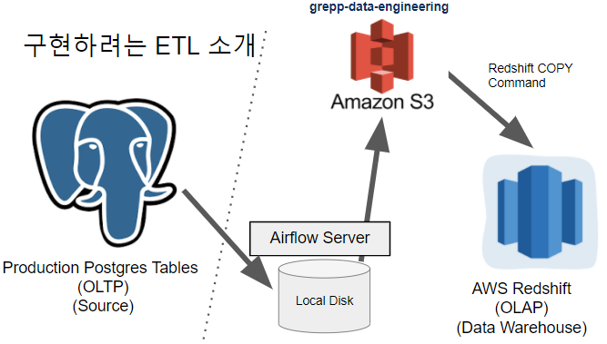
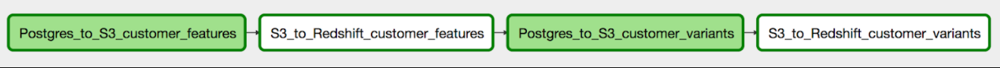

# 📌 1. 트랜잭션 구현방법

무엇을 사용할지는 개인 취향

### 1-1) PostgreSQL의 트랜잭션

- 기본적으로 모든 SQL statement가 바로 커밋됨
- 이를 바꾸고 싶다면 BEGIN;END; 혹은 BEGIN;COMMIT을 사용 (둘 다 똑같은 역할을 함)

### 1-2) psycopg2의 트랜잭션

- autocommit이라는 파라미터로 조절가능
- autocommit=True가 되면 기본적으로 PostgreSQL의 커밋 모드 사용
- autocommit=False가 되면 커넥션 객체의 .commit()과 .rollback(), cur.execute("COMMIT;")함수로 트랜잭션 조절 가능

</br>

# 📌 2. Redshift 에서 Primary Key 유지 방법

우선, DW(Data Warehouse)에서는 PK를 지켜주지 않는다.</br>
이유는 PK를 지켜주는 순간 데이터가 들어갈 때마다 비교를 해야하기 때문에 많은 데이터들이 들어올 때마다 계속해서 비교를 한다면 속도가 느려지기 때문이다.

### 2-1)유지하는 방법

**1. `tmp_테이블이름` 을 생성**

```sql
CREATE TABLE raw_data.tmp_name_gender (
    name character varying(100) PRIMARY KEY,
    gender character varying(100)
);
```

**2. 거기로 모든 레코드를 복사**

```sql
INSERT INTO raw_data.tmp_name_gender VALUES ('Keeyong', 'Male');
INSERT INTO raw_data.tmp_name_gender VALUES ('Keeyong', 'Male');
```

**3. 중복을 걸러주는 SQL 작성**</br>
`ROW_NUMBER`를 이용해서 primary key로 partition을 잡고 적당한 다른 필드(보통 타임스탬프 필드)로 ordering을 수행해 primary key별로 하나의 레코드를 잡아냄

**4. 위의 SQL을 바탕으로 최종 원본 테이블로 복사**

</br>

# 📌 3. Airflow의 Backfill 방식

### 3-1) Daily Incremental Update를 구현해야 한다면?
예를 들어 2020년 11월 7일날부터 매일매일 하루치 데이터를 읽어온다고 가정해보자</br>
**이 경우 언제부터 해당 ETL이 동작해야하나?**

- 2020년 11월 8일

**2020년 11월 8일날 동작하지만 읽어와야 하는 데이터의 날짜는?**

- 2020년 11월 7일

### 3-2) Incremental하게 1년치 데이터를 Backfill 해야한다면?

어떻게 ETL을 구현해놓으면 이런 일이 편해질까?

**1) 해결방법 1**</br>
코드 내에서 어느 날짜 어느 시간을 읽어와야하는지 계산하는 방법

- 기존 ETL 코드를 조금 수정해서 지난 1년치 데이터에 대해 돌린다
- 실수하기 쉽고 수정하는데 시간이 걸림 (앞으로 나아가는대는 문제가 없는데, 전에 데이터를 다시 카피해 와야할 때는 코드를 수정해서 돌려야 하기 때문에 여러가지 문제가 있을 수 있다)

**2) 해결방법 2**</br>

- 시스템적으로 이걸 쉽게 해주는 방법을 구현한다
- 날짜를 지정해주면 그 기간에 대한 데이터를 다시 읽어온다
- 이것이 바로 **Airflow의 접근방식**
    - 모든 DAG 실행에는 “**execution_date**”이 지정되어 있음
    - execution_date으로 채워야하는 날짜와 시간이 넘어옴
    - **이(execution_date)를 바탕으로 데이터를 갱신하도록 코드를 작성해야함**

### 3-3) catchup

`catchup=True` default 값이다.</br>
catchup이 True이면 오늘 날짜와 start_date를 비교를 해서  start_date가 더 앞에 있으면 비어 있는 날짜만큼 실행된다. (정확히 말하면 start_date부터가 아닌 start_date 다음 날부터 실행이 된다.)

`catchup=False`

 catchup이 False이면 하루만 실행된다. (언제 실행되는거지 ? 오늘날짜?)</br>
테스트를 할 때 False로 하는게 좋을 것 같다.?</br>
테스트 할 때 날짜를 미래의 날짜로 하면 안 되는 것 같음.</br>
과거의 날짜로 하면 돌아가긴 함.

</br>

# 📌 4. start_date 이해하기

2020-08-10 02:00:00로 start date로 설정된 daily job이 있다

- **catchup**이 True로 설정되어 있다고 가정 (디폴트가 True)

```python
# catchup False로 설정하는 방법

from datetime import datetime, timedelta
from airflow import DAG
default_args = {
   'owner': 'keeyong',
   'start_date': datetime(2020, 8, 7, hour=0, minute=00),
   'end_date': datetime(2020, 8, 31, hour=23, minute=00),
   'email': ['keeyonghan@hotmail.com'],
   'retries': 1,
	 'catchup' : False,       # 이렇게 해주면 됨 => (수정) 여기에 적으면 안 됨.
   'retry_delay': timedelta(minutes=3),
}

# DAG() 안에 적어줘야 함. 
dag = DAG(
    dag_id = 'CTAS_Summary_Table',
    start_date = datetime(2021,2,9),
    schedule_interval="@daily",
    max_active_runs = 1,
    catchup = False,        # 이렇게 여기에 적어줘야 함, default_args에 적으면 안 됨.
    default_args = {
        'owner' : 'insutance',
        'email' : ['insutance@naver.com'],
        'retries': 1,
        'retry_delay': timedelta(minutes=3),
    }
)
```

지금 시간이 2020-08-13 20:00:00이고 처음으로 이 job이 활성화되었다

**Question) : 이 경우 이 job은 몇 번 실행될까?**
|execution_date | 실행 날짜 | 비고 |
|--|--|--|
| 2020-08-10 02:00:00   | 2020 08 11 실행 | 
| 2020-08-11 02:00:00   | 2020 08 12 실행 | 
| 2020-08-12 02:00:00   | 2020 08 13 실행 | 
| 2020-08-13 02:00:00   | 2020 08 14 실행 | 이건 실행될 것 같지만 실행 안 됨. <br>(08.13 2시가 execution_date이지만, <br>이건 다음 날인 08.14에 실행됨)

<br>

# 📌 5. Important DAG parameters (not task parameters)

5-1) **max_active_runs** 

- of DAGs instance
- 동시에 실행시킬 수 있는 DAG의 수

5-2) **concurrency**

- of tasks that can run in parallel
- DAG에 속한 TASK들을 동시에 몇개 실행시킬 건지

5-3) **catchup**

- whether to backfill past runs
- 만약 과거의 작업은 중요하지 않고, 현재 시점의 이후 DAG만 실행되어야 한다면, 설정을 변경할 수 있다.

**<DAG parameters vs. Task parameters의 차이점 이해가 중요>**

- 위의 파라미터들은 모두 **DAG 파라미터**로 **DAG 객체**를 만들 때 지정해주어야함
- default_args로 지정해주면 에러는 안 나지만 적용이 안됨
    - default_args로 지정되는 파라미터들은 태스크 레벨로 적용되는 파라미터들

<br>

# 📌 6. Operators - PythonOperator

```python
test_task = PythonOperator(
   dag=dag,
   task_id='task_id',
   python_callable=python_func,
   **params={                            # parms로 필요한 데이터 값을 넘겨줄 수 있다.
       'table': 'delighted_nps',
       'schema': 'raw_data'
   },**
   **provide_context=True                # 그 때 provide_contest=True 로 설정해야 한다.**
)

"""
Setting provide_context to True enables passing params dictionary (in red) 
to the corresponding Python function (python_func here)
"""
```

위처럼 설정한 후 파이썬 코드에서 아래와 같이 작성할 수 있다.

```python
def python_func(****cxt**):
  table = **cxt["params"]["table"]**
  schema = **cxt["params"]["schema"]**
  ex_date = cxt["execution_date"]

  # do what you need to do
  ...
```

<br>

# 📌 7. xcom 사용하기

하나의 task에서 나온 데이터 값을 다른 task에서 사용하려고 할 때 `xcom`을 사용한다.

**issue)**

1. 데이터들이 메모리에 저장 되는데 큰 오브젝트를 주고 받을 때는 사용할 수 없다.
2. DAG가 여러개가 동시에 돌고, xcom으로 큰 데이터를 주고 받는다면 메모리가 금방차서 문제가 생긴다.
3. xcom은 작은 데이터를 주고 받을 때 사용하는게 좋다.
4. **데이터가 커지면 파일로 저장하고 파일 이름을 주고 받는게 훨씬 좋다.**

<br>

# 📌 8. Variable , Connection

### 8-1) Variable

특정 환경변수들을 코드 안에 안 쓰고 Airflow 환경 안에 저장할 수 있다.<br>
자주 바뀌는 값인데 코드로 바꾸기 번거로운 경우 Airflow Web UI→Variable 탭에서 설정해주면 된다.

- 사용하기 위해서는 `from airflow.models import Variable` 을 해야한다.
- Variable 값을 읽어올 때는 `Variable.get("KEY값")` 해주면 된다.
- Variable 값을 코드에서 바꾸고 싶다면 `Variable.set("KEY값") = 바꾸려는 값` 해주면 된다.

### 8-2) Connection

python코드에서 redshift에 연결을 해줄 때 host 이름, user이름, password 등.. 이 다 코드 안에 작성이 된다. 이렇게 코드 안에 작성하면 좋은 것이 아니다.

connection을 사용하면 외부와 account정보를 주고 받아서 인증을 하고 access를 받는 경우 그런 정보들을 connection 안에다가 다 암호화할 수 있다.

이것을 사용하면 Connection Object 받는 코드가 줄어들 것이다.(현재 하는 것보다)

<br>

# 📌 9. How to Trigger DAGs

### 1) Web UI에서 하는 방법

### 2) 터미널에서 실행

`$ airflow list_dags` : 지금 등록된 모든 dags를 보여줌<br>
`$ airflow list_tasks DAG이름` : DAG에 속하는 tasks을 보여줌<br>
`$ airflow test DAG이름 Task이름 날짜` : 실행 (날짜는 YYYY-MM-DD)<br>
(start_date보다 과거이거나 오늘 날짜보다 미래인 경우 실행 안됨)

- test로 실행시키는 것은 scheduler를 통해서 실행되는 것이 아니다. 내가 실행할 때 바로 시작이 된다. 하지만 "**start_date보다 과거이거나 오늘 날짜보다 미래인 경우 실행 안됨"** 이건 기억해야 한다.

<br>

# 📌 10. Production DB(ex. postgres ..)에서 DW로 테이블 복사하기



OLTP : Online Transaction Processing (Data)<br>
OLAP : Online Analytical Processing (Data)

### 1) 테이블 복사 방법(1)

- Source Table을 Airflow에서 `SELECT *` 을 해서 다 읽어온다.
- 그 후 Redshift와 연결해 하나씩 `INSERT INTO` 를 진행한다.
- 장점 : 제일 쉽게 하는 방법
- 단점 : 시간이 오래 걸림

### 2) 테이블 복사 방법(2)

- Source Table을 다 읽어와서 Airflow Local Disk에 file로 저장한다.
- 그 file을 Amazon S3에 복사를 한 후, 그 위치를 기억한다.
- Redshift COPY Command를 사용해 Redshift에 **벌크 업데이트** 한다.
    - 벌크 업데이트 : 하나씩 업데이트 하는게 아니라 **한 번에** 벌크로 넣어준다.

---

### 3) 복사하기

1.  Postgress Connection 설정
2.  Redshift Connection 설정
3.  S3 Connection설정
4. Postgres의 테이블 리뷰 (OLTP, Data Source) : 무슨 테이블이 있는지 확인
5. Redshift(OLAP, Data Warehouse)에 해당 테이블 생성 (위에서 리뷰한 테이블 똑같이 생성)
6. Variable 설정하기
    - csv_url
        - [https://s3-geospatial.s3-us-west-2.amazonaws.com/name_gender.csv](https://s3-geospatial.s3-us-west-2.amazonaws.com/name_gender.csv)
    - iam_role_for_copy_access_token (Redshift에 S3 액세스 권한을 주기 위함)
        - arn:aws:iam::080705373126:role/redshift.read.s3

<br>

# 📌 11. Postgres_to_Redshift DAG의 Task 구성



### **Postgres_to_S3_customer_features**

- PostgresToS3Operator
- customer_features table in Postgres -> a local file -> S3 (s3://**grepp-data-engineering**/{본인ID}/customer_features.csv)

### **S3_to_Redshift_customer_features**

- S3ToRedshiftOperator
- S3 (s3://**grepp-data-engineering**/{본인ID}/customer_features.csv) -> Redshift ({본인스키마.customer_features)
- COPY command is used